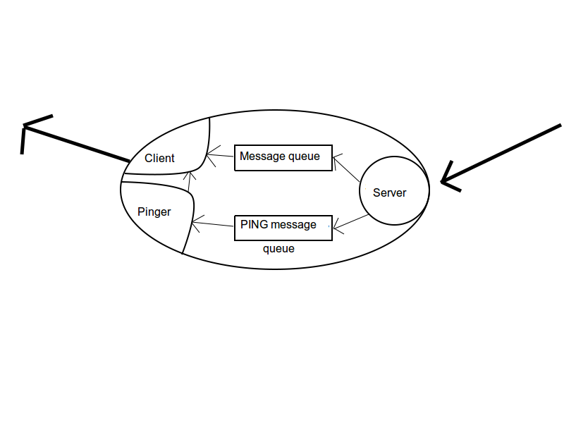

How distributed-chat works
==========================

How it works
------------

When node is starting it gets information about IP address and port, where it will listen.
It can be also specified IP address and port of the next node, to which will this node connects.

If this information is omitted (IP address and port of next node),
node will connect with itself and bootstrap the network.

Adding node in to network
~~~~~~~~~~~~~~~~~~~~~~~~~
Other nodes which are connecting, will form unidirectional virtual ring network.

The situation can be described as follows.

1. Let's have two interconnected nodes A and B (A->B, B->A).
2. New node C will contact node A, that he want to join into a ring.
3. Node A tells information about his successor to node C.
4. Node A sets his next node as node C.
5. Node C will set his next node as node B, based on the information he received from node A.
6. For node B nothing has changed.
7. Situation after successfully connecting is this: A->C, C->B, B->A.

Graceful exit of node from network
~~~~~~~~~~~~~~~~~~~~~~~~~~~~~~~~~~

Lets expect situation after successful connection form previous chapter (A->C, C->B, B->A).

If node A decides to leave the ring, it sends CLOSE message to his next node (node C).
This message is forwarded until it reaches the node (node B), that has node A as his successor.
This message contains information about successor of node A (that means information about node C).
Node B will change his next node based on the information from the message (node C).
Node B then sends DIE message, to node A, signaling that it is safe to leave the ring.

Unexpected leave of node from network
~~~~~~~~~~~~~~~~~~~~~~~~~~~~~~~~~~~~~

In the network continuous PING messages are sent. Each node checks if node behind him is sending PING messages.
Those messages are sent each 2 seconds. If node (node A) doesn't receive PING message three times in the row,
node behind him is presume dead (node B). Node A then sends message WHO_IS_DEAD, which contains information about node A.
This message is forwarded in the ring, until it reaches the dead end. Last node, that is before the dead node, set his
next node based on the information from the message (node A). Connection is then repaired.

Sending text messages in the network
~~~~~~~~~~~~~~~~~~~~~~~~~~~~~~~~~~~~
If node sends text message to the other node, this message is forwarded until it reaches the leader.
Leader will mark this message and then is this message forwarded until it reaches target recipient.
Recipient will display this message.

Node representation
-------------------

   Diagram of node

Each node consists of several parts:

- Server
- Client
- Pinger
- Message queue
- PING message queue

Node is identified by ID calculated as SHA hash from string IPaddress:port.
Node can also have nickname which is used for simplified sending of text messages.

Server
~~~~~~
When node start is initialize server and lets him listen of specified interface.
This server is run in separated thread. When server receives a message it creates new thread with handler function.
This function decides what to the with message based on the type of message.

- If message is type of DIE, is puts None in the message queue.
- If message is type of PING, it is placed into PING message queue.
- If message is some other type, it is placed into ordinary message queue.

Client
~~~~~~
Client is initialized right after server, also in the separated thread. Client in endless loop fetches messages
from ordinary message queue.
Fetched message is processed in function, then based on the inner state and type of message is decided what to do next and
if some message will be sent.

If client fetches None message, it is information that can safely exists main loop.

Pinger
~~~~~~
This part of node is responsible for fetching PING messages from PING message queue.
It also checks if node behind is sending PING messages. If node being didn't send
PING message in specified timeout, action will be taken to repair virtual ring.

Chang-Roberts algorithm
-----------------------
This algorithm is run in three main events:

- New node has joined into a ring.
- Node has disconnected from a ring.
- Node has died.

The two part algorithm can be described as follows [Wiki]_:

1. Initially each process in the ring is marked as non-participant.
2. A process that notices a lack of leader starts an election. It creates an election message containing its UID. It then sends this message clockwise to its neighbour.
3. Every time a process sends or forwards an election message, the process also marks itself as a participant.
4. When a process receives an election message it compares the UID in the message with its own UID.

- If the UID in the election message is larger, the process unconditionally forwards the election message in a clockwise direction.
- If the UID in the election message is smaller, and the process is not yet a participant, the process replaces the UID in the message with its own UID, sends the updated election message in a clockwise direction.
- If the UID in the election message is smaller, and the process is already a participant (i.e., the process has already sent out an election message with a UID at least as large as its own UID), the process discards the election message.
- If the UID in the incoming election message is the same as the UID of the process, that process starts acting as the leader.

When a process starts acting as the leader, it begins the second stage of the algorithm.

1. The leader process marks itself as non-participant and sends an elected message to its neighbour announcing its election and UID.
2. When a process receives an elected message, it marks itself as non-participant, records the elected UID, and forwards the elected message unchanged.
3. When the elected message reaches the newly elected leader, the leader discards that message, and the election is over.

Logging
-------

CLI mode
~~~~~~~~

All events and received messages are logged into a file which is named nodeID.log.
Critical events are also logged into standard error output. Received text messages are printed to standard output.

You can set how much detailed messages will be printed with -v option. You can enter this option multiple times
for more verbose output.

GUI mode
~~~~~~~~

In GUI mode all events are printed into separated tab called Log. You cannot select verbose level, it already set to the
highest level.

Reference
---------

   .. [Wiki] Chang-Roberts algorithm, https://en.wikipedia.org/wiki/Chang_and_Roberts_algorithm
